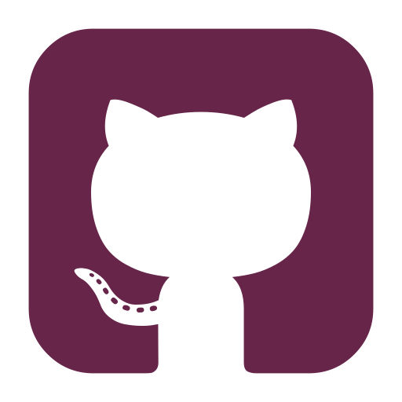

<h1 align="center">Hi 👋, I'm Shehzad Ansari</h1>
<h2 align="center">Aspiring MERN Stack Developer | BCA Graduated</h2>

  <!-- Social icons section -->
  
  &#8287;&#8287;&#8287;&#8287;&#8287;
  
  &#8287;&#8287;&#8287;&#8287;&#8287;
  
  &#8287;&#8287;&#8287;&#8287;&#8287;
   
  &#8287;&#8287;&#8287;&#8287;&#8287;

 

  

    
  

  

    
  

  - 🌱 Currently, I'm exploring **JavaScript**.

  - 📚 I hold a degree in **BCA** [Bachelor of Computer Application].

  - 💡 I enjoy tackling challenging problems and collaborating on innovative projects.

  - 🎯 My goal is to become a **MERN Stack** Developer.

  - 👨‍💻 All of my **projects** are available at [https://github.com/ShehzadCodeArt](https://github.com/ShehzadCodeArt)

  - 📫 How to reach me **shehzadaslam002@gmail.com**

 

 

 

# 🚀 Programming Languages:

### 💻 Core Programming Skills:

### 🌐 Web Development:
  

### 🛠️ Tools and Platforms:
 

 

# 📊 Github Stats and Activity
  <h3>🔥 Streak Stats</h3>

  <!-- GitHub Readme Streak Stats - https://github.com/DenverCoder1/github-readme-streak-stats -->
  

    
    <!-- 
🔥 Get streak stats for your profile at <a href="https://git.io/streak-stats">git.io/streak-stats</a>
 -->
  

  <h3>💻 GitHub Profile Stats</h3>

  <!-- https://github.com/anuraghazra/github-readme-stats -->

  
  
   

  <b>Note:</b> Top languages is only a metric of the languages my public code consists of and doesn't reflect experience or skill level.
  
  <!-- https://github.com/ashutosh00710/github-readme-activity-graph -->

  

## 🏆 GitHub Trophies

### ✍️ Random Dev Quote

### 🔝 Top Contributed Repo

### 😂 Random Dev Meme

---
